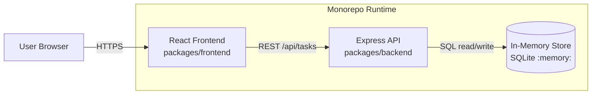

# Cloud Architecture Overview

This document provides a simple system context view of the TODO monorepo runtime architecture.

## System Context



    ## Create TODO Sequence

    ```mermaid
    sequenceDiagram
        autonumber
        actor User as User
        participant FE as React Frontend
        participant API as Express API
        participant DB as In-Memory SQLite

        User->>FE: Enter title/description/due date and submit
        FE->>API: POST /api/tasks\n{ title, description, due_date }
        API->>API: Validate payload (title required)
        API->>DB: INSERT INTO tasks (...)
        DB-->>API: New task id
        API->>DB: SELECT * FROM tasks WHERE id = ?
        DB-->>API: Created task row
        API-->>FE: 201 Created + task JSON
        FE->>API: GET /api/tasks (refresh list)
        API->>DB: SELECT * FROM tasks ORDER BY ...
        DB-->>API: Task list
        API-->>FE: 200 OK + tasks JSON
        FE-->>User: Render updated TODO list
    ```

## Notes

- The frontend is a React single-page application.
- The backend is an Express API serving task endpoints.
- Data is stored in an in-memory SQLite database and is reset when the backend process restarts.
- This diagram is intentionally high-level and omits implementation details.
